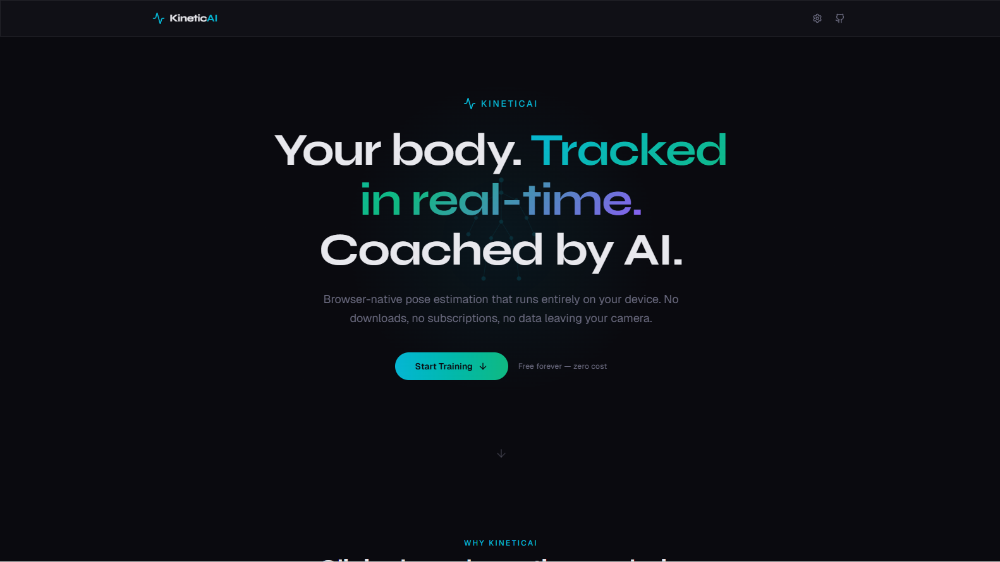
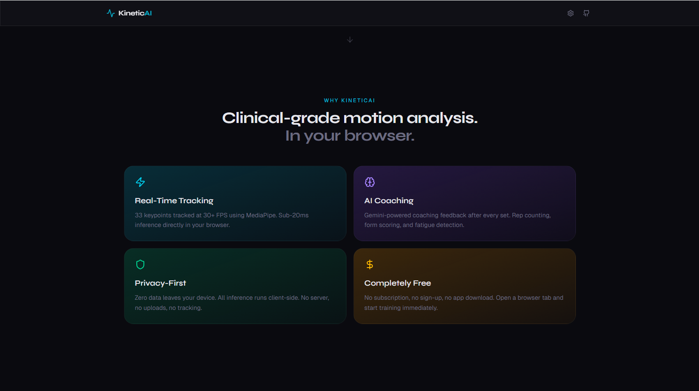
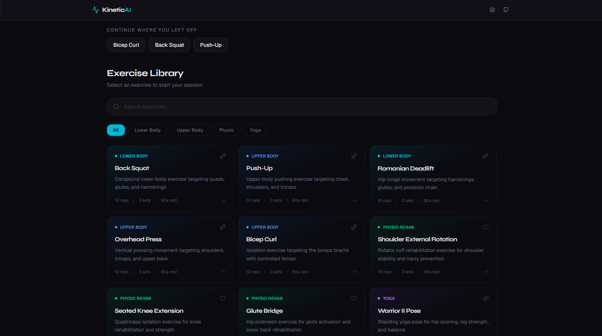
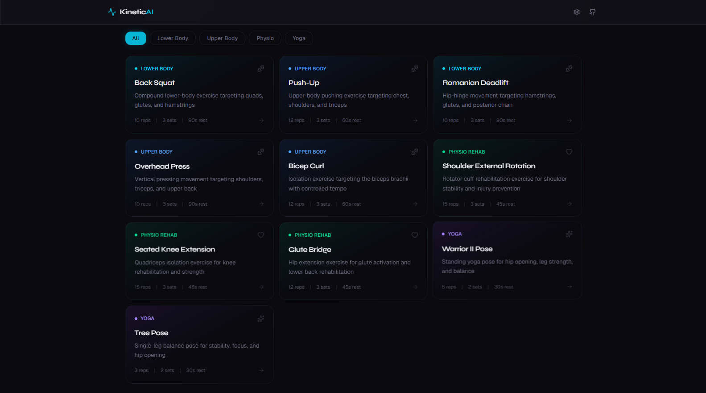
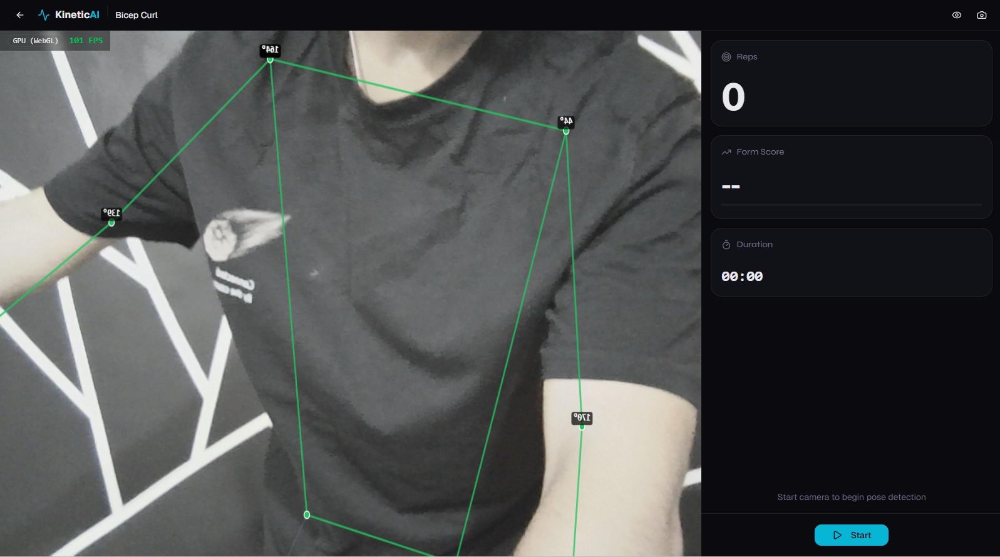
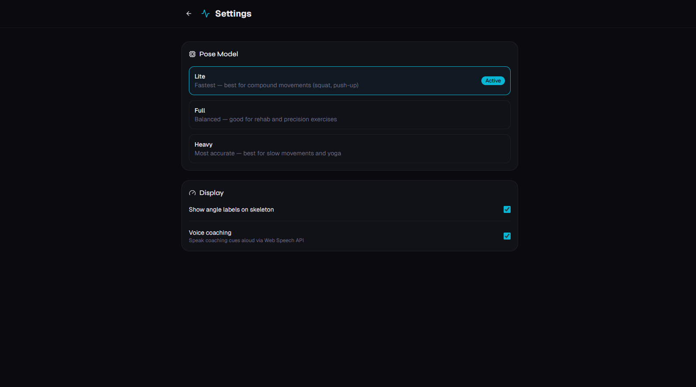

# KineticAI

**Real-time pose estimation & AI form coaching — entirely in your browser.**

> [Live Demo](https://projectkineticai.vercel.app/) | [GitHub](https://github.com/ninjacode911/Project-KineticAI)

KineticAI uses Google's MediaPipe Pose Landmarker to track 33 body keypoints at 30+ FPS, compute joint angles, count reps, score form quality, detect fatigue, and deliver AI-powered coaching feedback — all running client-side with zero data leaving your device.

---

## Screenshots

### Hero & Landing Page
The landing page features an animated wireframe body silhouette, gradient text, and a smooth scroll-reveal design built with Framer Motion.



### Feature Highlights
Four key differentiators — real-time tracking, AI coaching, privacy-first architecture, and zero cost — presented with category-specific gradient cards.



### Exercise Library
Browse 10 exercises across 4 categories (Strength, Physio Rehab, Yoga) with search, category filters, and recent exercise shortcuts. Each card shows reps, sets, and rest targets.





### Live Pose Tracking Session
Real-time 33-keypoint skeleton overlay on the camera feed with joint angle labels, FPS counter, and a split-screen metrics panel showing reps, form score, and duration.



### Settings
Configure the pose model variant (Lite/Full/Heavy), toggle angle labels, and enable voice coaching via Web Speech API.



---

## Features

- **Real-Time Pose Tracking** — 33 keypoints with 3D coordinates via MediaPipe, rendered as a skeleton overlay on your camera feed
- **Rep Counting** — Finite state machine tracks exercise phases (standing, descending, bottom, ascending) with configurable angle thresholds per exercise
- **Form Scoring** — 5-component weighted score (depth 30%, alignment 25%, symmetry 20%, control 15%, ROM 10%) computed per rep
- **Fatigue Detection** — Monitors depth fade, symmetry collapse, speed collapse, and rolling form trend across reps
- **AI Coaching** — Post-set feedback via Gemini 2.0 Flash API with rule-based real-time micro-cues as offline fallback
- **Voice Coaching** — Speaks coaching cues aloud via Web Speech API during exercise
- **PDF Reports** — Client-side session reports with rep-by-rep breakdown, generated via pdfmake (no server upload)
- **10 Exercises** — Squat, push-up, Romanian deadlift, overhead press, bicep curl, shoulder external rotation, knee extension, glute bridge, Warrior II, tree pose
- **Privacy-First** — Zero backend, zero data uploads. All ML inference runs on your device.
- **Zero Cost** — No subscription, no sign-up, no app download. Deployed on Vercel free tier.

---

## Tech Stack

| Layer | Technology |
|-------|-----------|
| Framework | React 19, TypeScript (strict), Vite 8 |
| Pose Estimation | MediaPipe Tasks Vision (`@mediapipe/tasks-vision`) |
| Styling | Tailwind CSS v4, shadcn/ui |
| Animation | Framer Motion |
| State Management | Zustand (persisted in localStorage) |
| AI Coaching | Gemini 2.0 Flash API (free tier, 1M tokens/day) |
| PDF Reports | pdfmake (client-side generation) |
| Testing | Vitest (26 unit tests) |
| CI/CD | GitHub Actions (tsc + lint + test + build) |
| Deployment | Vercel (free tier, zero config) |

---

## Getting Started

```bash
git clone https://github.com/ninjacode911/Project-KineticAI.git
cd Project-KineticAI
npm install
```

### Set up Gemini API key (optional — app works without it)

```bash
cp .env.example .env.local
# Edit .env.local and add your free Gemini API key from https://ai.google.dev/
```

### Run locally

```bash
npm run dev
# Open http://localhost:5173 and allow camera access
```

### Run tests

```bash
npm test
```

### Build for production

```bash
npm run build
npm run preview
```

---

## Project Structure

```
src/
├── pages/              # Route pages (Home, Session, Review, Settings)
├── components/         # React components (UI, exercise, session, layout)
├── hooks/              # Custom hooks (camera, pose detection, session)
├── lib/
│   ├── analysis/       # Joint angles, rep counter, form scorer, fatigue
│   ├── coaching/       # Gemini API + rule-based cues
│   ├── pose/           # MediaPipe loader, keypoint mapper
│   ├── rendering/      # Canvas skeleton renderer
│   └── report/         # PDF generation
├── data/
│   └── exercises/      # 10 exercise configs with golden angle ranges
├── stores/             # Zustand state (session, settings, history)
└── types/              # TypeScript interfaces
```

---

## How It Works

```
Camera (WebRTC, 720p @ 30fps)
  │
  ▼
MediaPipe PoseLandmarker → 33 keypoints (x, y, z, visibility)
  │
  ▼
Joint Angle Engine → 12 joint angles via law of cosines
  │
  ▼
Rep Counter FSM → STANDING → DESCENDING → BOTTOM → ASCENDING → rep counted
  │
  ├──▶ Form Scorer → depth + alignment + symmetry + control + ROM = 0-100 score
  ├──▶ Fatigue Detector → depth fade, symmetry collapse, speed collapse, form trend
  └──▶ Coaching Engine → rule-based micro-cues (real-time) + Gemini AI (post-set)
  │
  ▼
Canvas Skeleton Overlay + Metrics Panel + PDF Session Report
```

---

## Privacy & Security

- **Zero data leaves your device** — all pose estimation runs client-side via MediaPipe WASM/WebGL
- **No backend server** — no database, no user accounts, no tracking
- **Gemini API receives only aggregated numbers** — exercise name, rep count, angle averages. Never video, images, or PII.
- **Session history stored in localStorage** — stays on your browser, never uploaded

---

## License

MIT

## Author

**Navnit Amrutharaj** — [GitHub](https://github.com/ninjacode911)
